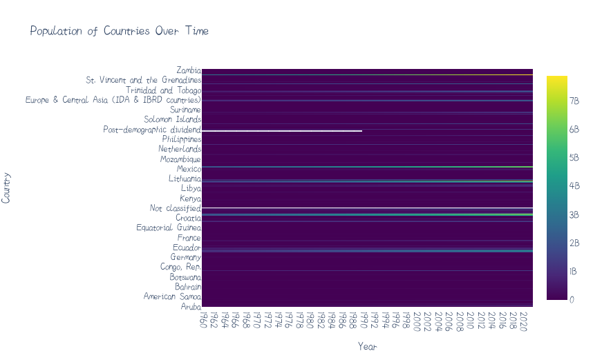
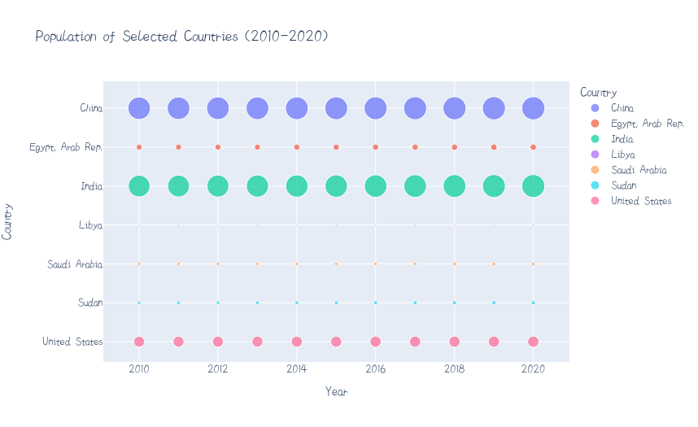

# World_population_analysis
This project includes loading, cleaning, and visualizing population data. The data is loaded from a CSV file and then cleaned by filtering, melting, and dropping unwanted columns. Finally, the data is visualized using different libraries including matplotlib, plotly, and pandas. Different types of visualizations were used such as line charts, choropleth maps, and bubble charts to show population trends and comparisons between different countries.
 
 
